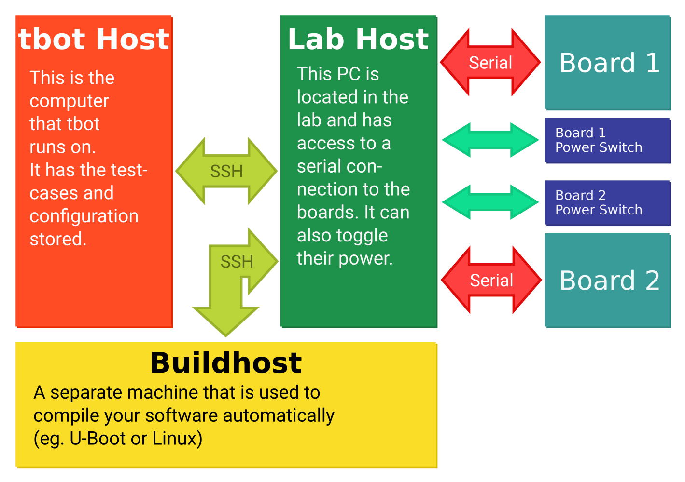

<p align="center">
  <br />
  <a href="https://www.python.org/"></a>
  <a href="http://mypy-lang.org/"></a>
  <a href="https://github.com/ambv/black"></a>
  <a href="https://travis-ci.com/Rahix/tbot"></a><br />
  Embedded Test/Automation Tool
</p>

**tbot** is a testing/automation tool that is focused on usage in embedded development.  At its core *tbot* just provides utilities for interaction with remote hosts/targets and an extensive library of routines that are common in embedded development/testing.

*tbot* aims to be a support for the developer while working on a project and without much modification also allow running tests in an automated setting (CI).

Most info about *tbot* can be found in its documentation at <https://tbot.tools>.  You can also join our mailing list at [lists.denx.de](https://lists.denx.de/listinfo/tbot).

---

## Use-cases
*tbot* can very easily support complex test architectures with many different hosts and boards involved.  As an example:




## Installation
```bash
python3 setup.py install --user
```

If you haven't done it already, you need to add ``~/.local/bin`` to your ``$PATH``.


### Completions
*tbot* supports command line completions. Enable them by adding

```bash
source /path/to/tbot/completions.sh
```

to your ``.bashrc`` or equivalent.


## Example
Blinks a GPIO Led on your selected target.

```python
import time
import tbot
from tbot_contrib import gpio


@tbot.testcase
@tbot.with_linux
def blink(lnx, pin: int = 18) -> None:
    """Blink the led on pin ``pin``."""

    led = gpio.Gpio(lnx, pin)
    led.set_direction("out")
    for _ in range(5):
        led.set_value(True)
        time.sleep(0.5)
        led.set_value(False)
        time.sleep(0.5)
```

## Credits
* [fast-entry_points](https://github.com/ninjaaron/fast-entry_points)
* [paramiko](https://www.paramiko.org/)
* [termcolor2](https://pypi.org/project/termcolor2/)

## Contributing
Help is really appreciated!  Please take a look at *tbot*'s [contribution guidelines](CONTRIBUTING.md)
for more info.  If you are unsure about anything, please open an issue or consult
the mailing list first!

## License
tbot is licensed under the `GNU General Public License v3.0 or later`.  See [LICENSE](LICENSE) for more info.
